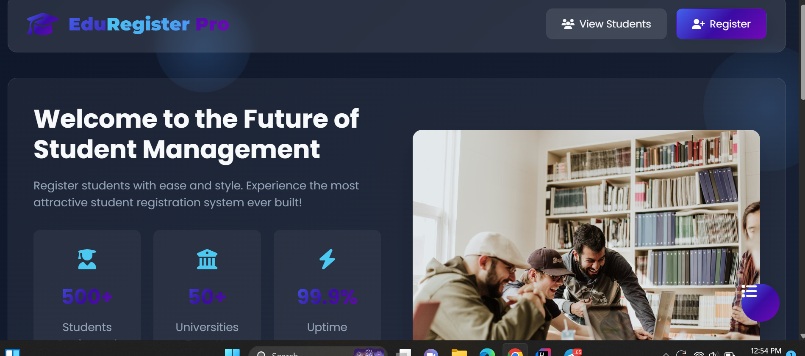

# Student Registration Web Application (Java Servlet + JDBC)

## 📌 Project Overview

This is a simple **Java Servlet-based web application** that allows users to:

* Register students into a database
* View a list of all registered students in an HTML table

The project is built using **Java Servlets, JSP, JDBC, MySQL, and Apache Tomcat**, and is suitable for beginners learning backend web development in Java.

---

## 🛠️ Technologies Used

* **Java (JDK 8+)**
* **Java Servlets**
* **JSP**
* **JDBC**
* **MySQL**
* **Apache Tomcat**
* **IntelliJ IDEA (Community or Ultimate)**

---

## Screenshot



## 📂 Project Features

### 1️⃣ Student Registration

**Endpoint:** `POST /register`

* Accepts:

    * Student Name
    * Email
    * Year
* Validates input
* Stores student data in the database

### 2️⃣ View All Students

**Endpoint:** `GET /show_all`

* Retrieves all students from the database
* Displays them in an HTML table (Name, Email, Year)

---

## Database Schema

### Database Name

```
student_db
```

### Table: `students`

| Column | Data Type    | Constraints                 |
| ------ | ------------ | --------------------------- |
| id     | INT          | Primary Key, Auto Increment |
| name   | VARCHAR(100) | Not Null                    |
| email  | VARCHAR(100) | Not Null, Unique            |
| year   | INT          | Not Null                    |

### SQL Script

```sql
CREATE DATABASE student_db;
USE student_db;

CREATE TABLE students (
    id INT AUTO_INCREMENT PRIMARY KEY,
    name VARCHAR(100) NOT NULL,
    email VARCHAR(100) NOT NULL UNIQUE,
    year INT NOT NULL
);
```

---

## 📁 Project Structure

```
StudentRegistrationApp
│
├─ src
│  └─ main
│     ├─ java
│     │  └─ com/example
│     │     ├─ model
│     │     │   └─ Student.java
│     │     ├─ dao
│     │     │   └─ StudentDAO.java
│     │     ├─ servlet
│     │     │   ├─ RegisterServlet.java
│     │     │   └─ ShowAllServlet.java
│     │     └─ utils
│     │         └─ DBUtil.java
│     │
│     └─ webapp
│         ├─ WEB-INF
│         │   └─ web.xml
│         ├─ register.jsp
│         └─ show_all.jsp
```

---

## ⚙️ Setup Instructions

### Step 1: Install Required Software

* Java JDK (8 or higher)
* MySQL Server
* Apache Tomcat
* IntelliJ IDEA
* MySQL JDBC Connector

---

### Step 2: Configure Database

* Create database and table using the SQL script above
* Update database credentials in `DBUtil.java`

```java
private static final String URL = "jdbc:mysql://localhost:3306/student_db";
private static final String USER = "root";
private static final String PASSWORD = "your_password";
```

---

### Step 3: Add JDBC Connector

* Add MySQL Connector JAR to the project libraries in IntelliJ

---

### Step 4: Configure Tomcat

* Add Tomcat as a **Local Server**
* Deploy the project as **Exploded Artifact**
* Start the server

---

## Application URLs

| Action            | URL                                                         |
| ----------------- | ----------------------------------------------------------- |
| Register Student  | `http://localhost:8080/StudentRegistrationApp/register.jsp` |
| View All Students | `http://localhost:8080/StudentRegistrationApp/show_all`     |

---

##  Learning Outcomes

By completing this project, you will learn:

* Java Servlet basics
* JDBC database operations
* MVC-style separation (Model, DAO, Servlet)
* Web application deployment using Tomcat
* Form handling and request/response flow

---

##  Future Improvements

* Add update and delete student functionality
* Add login/authentication
* Use Maven for dependency management
* Improve UI with CSS or Bootstrap
* Add server-side validation and error pages

---

